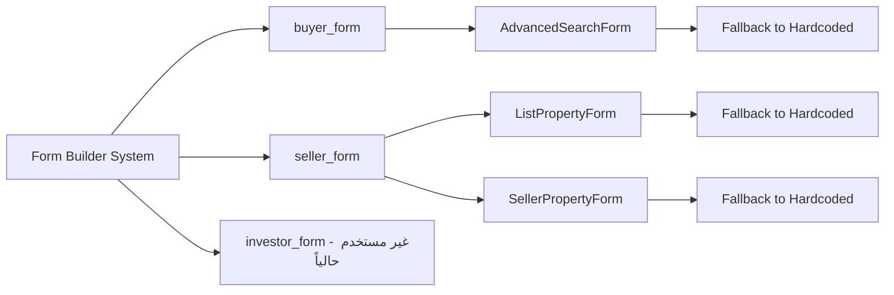
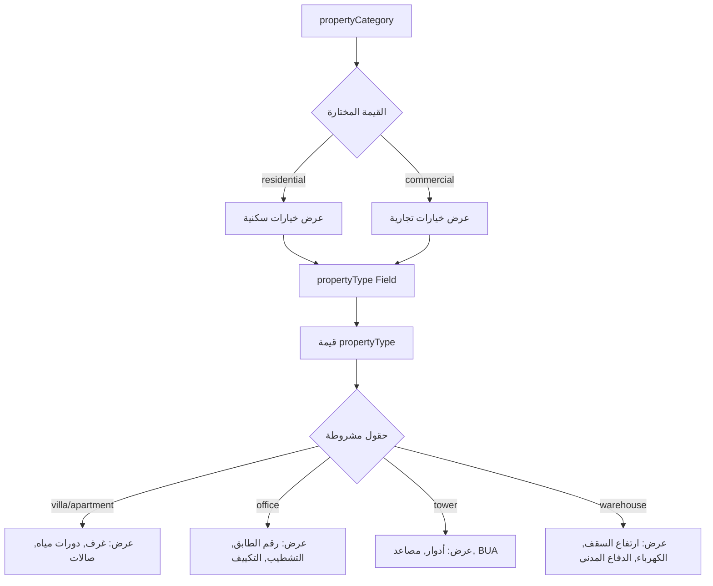
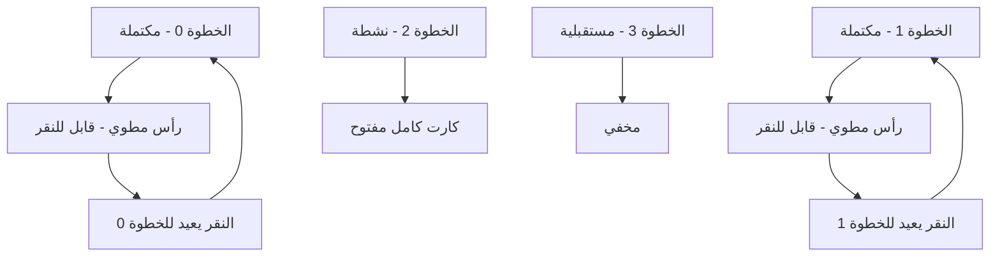

```mermaid
flowchart TD
    Start([المستخدم يفتح الصفحة الرئيسية]) --> HeroSection[HeroSection يعرض AdvancedSearchForm]
    HeroSection --> LoadConfig{محاولة جلب buyer_form من Form Builder}
    LoadConfig -->|موجود| UseFormBuilder[استخدام Form Builder Config]
    LoadConfig -->|غير موجود| UseHardcoded[استخدام الكود الثابت]
    
    UseFormBuilder --> InitForm[تهيئة الفورم]
    UseHardcoded --> InitForm
    
    InitForm --> Step0[الخطوة 0: المعلومات الشخصية]
    Step0 --> Step0Validate{التحقق من البيانات}
    Step0Validate -->|ناجح| AutoRegister[autoRegisterUser - تسجيل تلقائي]
    Step0Validate -->|فاشل| Step0
    
    AutoRegister --> Step1[الخطوة 1: تفاصيل الطلب]
    Step1 --> Step1Validate{التحقق}
    Step1Validate -->|ناجح| Step2
    Step1Validate -->|فاشل| Step1
    
    Step2[الخطوة 2: المدينة المفضلة] --> Step2Validate{التحقق}
    Step2Validate -->|ناجح| Step3
    Step2Validate -->|فاشل| Step2
    
    Step3[الخطوة 3: الحي المرغوب] --> Step3Validate{التحقق}
    Step3Validate -->|ناجح| Step4
    Step3Validate -->|فاشل| Step3
    
    Step4[الخطوة 4: نوع العقار] --> Step4Filter{تصفية حسب propertyCategory}
    Step4Filter -->|سكني| ShowResidential[عرض خيارات سكنية]
    Step4Filter -->|تجاري| ShowCommercial[عرض خيارات تجارية]
    ShowResidential --> Step4Validate{التحقق}
    ShowCommercial --> Step4Validate
    Step4Validate -->|ناجح| Step5
    Step4Validate -->|فاشل| Step4
    
    Step5[الخطوة 5: المواصفات الفنية] --> Step5Conditional{حقول مشروطة حسب propertyType}
    Step5Conditional --> ShowFields[عرض الحقول المناسبة]
    ShowFields --> Step5Analyzing[عرض شاشة 'جاري التحليل']
    Step5Analyzing --> Step5Validate{التحقق}
    Step5Validate -->|ناجح| Step6
    Step5Validate -->|فاشل| Step5
    
    Step6[الخطوة 6: الميزانية والاستثمار] --> Step6Payment{طريقة الشراء}
    Step6Payment -->|تمويل| ShowBank[عرض اختيار البنك والراتب]
    Step6Payment -->|كاش| Step6Validate
    ShowBank --> Step6Validate{التحقق}
    Step6Validate -->|ناجح| Step7
    Step6Validate -->|فاشل| Step6
    
    Step7[الخطوة 7: اللمسات الأخيرة] --> Step7Tags[اختيار التاقات الذكية]
    Step7Tags --> Step7Validate{التحقق}
    Step7Validate -->|ناجح| Submit[إرسال الطلب]
    Step7Validate -->|فاشل| Step7
    
    Submit --> HandleSearch[handleSearch يتم استدعاؤه]
    HandleSearch --> OnSearch[onSearch callback إلى HeroSection]
    OnSearch --> BuyerMutation[buyerMutation.mutate]
    BuyerMutation --> API[POST /api/buyers/register]
    
    API --> CreateUser{إنشاء/تحديث المستخدم}
    CreateUser --> CreatePreference[إنشاء BuyerPreference]
    CreatePreference --> SaveData[حفظ جميع البيانات]
    
    SaveData --> Success{نجح؟}
    Success -->|نعم| InvalidateQueries[invalidateQueries للـ requests و stats]
    Success -->|لا| ShowError[عرض رسالة خطأ]
    
    InvalidateQueries --> SetComplete[setIsComplete true]
    SetComplete --> ShowSuccess[عرض رسالة نجاح]
    
    ShowError --> End([النهاية])
    ShowSuccess --> End
```

```mermaid
flowchart TD
    Start([المستخدم يفتح /investor]) --> InitForm[تهيئة الفورم الثابت - 5 خطوات]
    
    InitForm --> Step0[الخطوة 0: المعلومات الشخصية]
    Step0 --> Step0Validate{التحقق من الاسم والهاتف}
    Step0Validate -->|ناجح| Step1
    Step0Validate -->|فاشل| Step0
    
    Step1[الخطوة 1: الاستراتيجية الاستثمارية] --> Step1Options[نمو رأس المال / دخل ثابت / مزيج]
    Step1Options --> Step1Validate{التحقق}
    Step1Validate -->|ناجح| Step2
    Step1Validate -->|فاشل| Step1
    
    Step2[الخطوة 2: المدن المفضلة] --> Step2Select[اختيار مدن متعددة]
    Step2Select --> Step2Validate{التحقق - مدن محددة؟}
    Step2Validate -->|نعم| Step3
    Step2Validate -->|لا| Step2
    
    Step3[الخطوة 3: فئات الأصول] --> Step3Options[سكني / تجاري / صناعي / أراضي / فندقي / متعدد]
    Step3Options --> Step3Select[اختيار فئات متعددة]
    Step3Select --> Step3Validate{التحقق - فئات محددة؟}
    Step3Validate -->|نعم| Step4
    Step3Validate -->|لا| Step3
    
    Step4[الخطوة 4: الميزانية] --> Step4Budget[الحد الأدنى / الحد الأقصى / عائد الاستثمار]
    Step4Budget --> Step4Validate{التحقق - ميزانية محددة؟}
    Step4Validate -->|نعم| Submit[إرسال البيانات]
    Step4Validate -->|لا| Step4
    
    Submit --> InvestorMutation[investorMutation.mutate]
    InvestorMutation --> TransformData[تحويل البيانات]
    TransformData --> ConvertArrays[تحويل Arrays إلى نص مفصول بفواصل]
    ConvertArrays --> API[POST /api/investors/register]
    
    API --> CreateUser{إنشاء/تحديث المستخدم}
    CreateUser --> CreatePreference[إنشاء InvestorPreference]
    CreatePreference --> SaveData[حفظ جميع البيانات]
    
    SaveData --> Success{نجح؟}
    Success -->|نعم| SetComplete[setIsComplete true]
    Success -->|لا| ShowError[عرض رسالة خطأ]
    
    SetComplete --> ShowSuccess[عرض شاشة النجاح]
    ShowSuccess --> CustomMessage[رسالة شكر مخصصة حسب الاستراتيجية]
    
    ShowError --> End([النهاية])
    CustomMessage --> End
```

# تحليل فلو الفورمات (Buyer, Seller, Investor)

## نظرة عامة

هذا المستند يحتوي على تحليل شامل للفلو (Flow) الخاص بالفورمات الثلاثة في النظام:
- **فورم المشتري** (AdvancedSearchForm)
- **فورم البائع** (ListPropertyForm / SellerPropertyForm)
- **فورم المستثمر** (InvestorPage)

---

## 1. فورم المشتري (AdvancedSearchForm)

### نقطة البداية
- **المكون**: `AdvancedSearchForm` في `client/src/components/AdvancedSearchForm.tsx`
- **الاستدعاء**: من `HeroSection` في الصفحة الرئيسية
- **التكامل**: يستخدم `useFormBuilderConfig("buyer_form")` مع fallback للكود الثابت

### التدفق الكامل



### البيانات المحفوظة

#### User Table
```typescript
{
  name: string;
  phone: string; // 05xxxxxxxx
  email: string;
  role: "buyer";
  passwordHash: string; // auto-generated
}
```

#### BuyerPreference Table
```typescript
{
  userId: string;
  city: string;
  districts: string[]; // JSON array
  propertyType: string;
  propertyCategory: "residential" | "commercial";
  transactionType: "buy" | "rent";
  propertyCondition: "new" | "used" | "under_construction";
  rooms?: number;
  area?: number;
  budgetMin?: number;
  budgetMax?: number;
  paymentMethod?: "cash" | "finance";
  bankName?: string;
  salary?: number;
  smartTags: string[]; // JSON array
  notes?: string;
}
```

### الميزات الخاصة

1. **التسجيل التلقائي**: في الخطوة الأولى، يتم تسجيل المستخدم تلقائياً إذا لم يكن مسجلاً
2. **شاشة التحليل**: في الخطوة 5، يتم عرض شاشة "جاري التحليل" لمدة 1.5 ثانية
3. **حساب النقاط**: يتم حساب `reliabilityScore` بناءً على البيانات المدخلة
4. **الحقول الشرطية**: `propertyType` يعرض خيارات مختلفة بناءً على `propertyCategory`

---

## 2. فورم البائع (ListPropertyForm / SellerPropertyForm)

### نقطة البداية
- **المكونات**: 
  - `ListPropertyForm` في `client/src/components/ListPropertyForm.tsx` (للصفحة الرئيسية)
  - `SellerPropertyForm` في `client/src/components/SellerPropertyForm.tsx` (لصفحة منفصلة)
- **الصفحات**: 
  - `/seller-form` (صفحة منفصلة)
  - HeroSection (في الصفحة الرئيسية)
- **التكامل**: يستخدم `useFormBuilderConfig("seller_form")` مع fallback

### التدفق الكامل

```mermaid
flowchart TD
    Start([المستخدم يفتح /seller-form أو يختار 'بائع']) --> CheckMode{وضع التعديل؟}
    
    CheckMode -->|نعم - propertyId موجود| LoadProperty[جلب بيانات العقار من API]
    CheckMode -->|لا - إنشاء جديد| LoadConfig
    
    LoadProperty --> MapData[تحويل Property إلى ListingData]
    MapData --> InitFormEdit[تهيئة الفورم ببيانات موجودة]
    
    LoadConfig{محاولة جلب seller_form من Form Builder}
    LoadConfig -->|موجود| UseFormBuilder[استخدام Form Builder Config]
    LoadConfig -->|غير موجود| UseHardcoded[استخدام الكود الثابت]
    
    UseFormBuilder --> InitForm[تهيئة الفورم]
    UseHardcoded --> InitForm
    InitFormEdit --> InitForm
    
    InitForm --> Step0[الخطوة 0: ابدأ إضافة عقارك]
    Step0 --> Step0Validate{التحقق من البيانات}
    Step0Validate -->|ناجح| Step1
    Step0Validate -->|فاشل| Step0
    
    Step1[الخطوة 1: تفاصيل العرض] --> Step1Validate{التحقق}
    Step1Validate -->|ناجح| Step2
    Step1Validate -->|فاشل| Step1
    
    Step2[الخطوة 2: موقع العقار] --> Step2Map[خريطة تفاعلية لتحديد الموقع]
    Step2Map --> Step2Select[اختيار المدينة]
    Step2Select --> Step2Validate{التحقق}
    Step2Validate -->|ناجح| Step3
    Step2Validate -->|فاشل| Step2
    
    Step3[الخطوة 3: تحديد الحي] --> Step3Filter[تصفية حسب الاتجاه]
    Step3Filter --> Step3Select[اختيار الأحياء]
    Step3Select --> Step3Validate{التحقق}
    Step3Validate -->|ناجح| Step4
    Step3Validate -->|فاشل| Step3
    
    Step4[الخطوة 4: نوع العقار] --> Step4Filter{تصفية حسب propertyCategory}
    Step4Filter -->|سكني| ShowResidential[عرض خيارات سكنية]
    Step4Filter -->|تجاري| ShowCommercial[عرض خيارات تجارية]
    ShowResidential --> Step4Validate{التحقق}
    ShowCommercial --> Step4Validate
    Step4Validate -->|ناجح| Step5
    Step4Validate -->|فاشل| Step4
    
    Step5[الخطوة 5: المواصفات الفنية] --> Step5Conditional{حقول مشروطة}
    Step5Conditional --> ShowFields[عرض الحقول المناسبة]
    ShowFields --> Step5Validate{التحقق}
    Step5Validate -->|ناجح| Step6
    Step5Validate -->|فاشل| Step5
    
    Step6[الخطوة 6: السعر المطلوب] --> Step6Validate{التحقق}
    Step6Validate -->|ناجح| Step7
    Step6Validate -->|فاشل| Step6
    
    Step7[الخطوة 7: مميزات إضافية] --> Step7Tags[اختيار التاقات الذكية]
    Step7Tags --> Step7Validate{التحقق}
    Step7Validate -->|ناجح| Submit[إرسال البيانات]
    Step7Validate -->|فاشل| Step7
    
    Submit --> ValidateEmail{التحقق من الإيميل}
    ValidateEmail -->|فاشل| ShowEmailError[عرض رسالة خطأ]
    ValidateEmail -->|ناجح| CheckEditMode{وضع التعديل؟}
    
    CheckEditMode -->|نعم| UpdateAPI[PATCH /api/properties/:id]
    CheckEditMode -->|لا| CreateAPI[POST /api/sellers/register]
    
    UpdateAPI --> UpdateProperty[تحديث بيانات العقار]
    UpdateProperty --> OnSave[onSave callback]
    OnSave --> ShowUpdateSuccess[عرض رسالة نجاح التحديث]
    
    CreateAPI --> CreateUser{إنشاء/تحديث المستخدم}
    CreateUser --> CreateProperty[إنشاء Property جديد]
    CreateProperty --> SaveData[حفظ جميع البيانات]
    
    SaveData --> CheckNewUser{مستخدم جديد؟}
    CheckNewUser -->|نعم| ShowNewUserMsg[عرض رسالة + انتظار 3 ثوان]
    CheckNewUser -->|لا| Redirect[Redirect فوري]
    
    ShowNewUserMsg --> Redirect
    Redirect --> ProfilePage[/profile?tab=properties]
    
    ShowEmailError --> End([النهاية])
    ShowUpdateSuccess --> End
    ProfilePage --> End
```

### البيانات المحفوظة

#### User Table
```typescript
{
  name: string;
  phone: string; // 05xxxxxxxx
  email: string; // إلزامي
  role: "seller";
  passwordHash: string; // auto-generated
}
```

#### Property Table
```typescript
{
  sellerId: string;
  propertyType: string;
  propertyCategory: "residential" | "commercial";
  city: string;
  district: string;
  price: number;
  area?: number;
  rooms?: number;
  bathrooms?: number;
  status: "ready" | "under_construction";
  amenities: string[]; // JSON array - smartTags
  description?: string; // notes
  latitude?: number;
  longitude?: number;
  images: string[]; // JSON array
}
```

### الميزات الخاصة

1. **خريطة تفاعلية**: في الخطوة 2، يمكن تحديد الموقع على الخريطة (latitude, longitude)
2. **وضع التعديل**: يدعم تعديل عقار موجود عبر `propertyId`
3. **Redirect تلقائي**: بعد النشر، يتم التوجيه تلقائياً إلى صفحة الملف الشخصي
4. **رسائل مخصصة**: رسائل مختلفة للمستخدمين الجدد والموجودين

---

## 3. فورم المستثمر (InvestorPage)

### نقطة البداية
- **المكون**: `InvestorPage` في `client/src/pages/investor.tsx`
- **الصفحة**: `/investor`
- **ملاحظة**: لا يستخدم Form Builder حالياً (كود ثابت فقط)

### التدفق الكامل



### البيانات المحفوظة

#### User Table
```typescript
{
  name: string;
  phone: string; // 05xxxxxxxx
  email?: string; // اختياري
  role: "investor";
  passwordHash?: string; // قد لا يكون موجوداً
}
```

#### InvestorPreference Table
```typescript
{
  userId: string;
  strategy: "capital_growth" | "income_focused" | "balanced";
  cities: string; // نص مفصول بفواصل - "الرياض, جدة, الدمام"
  investmentTypes: string; // نص مفصول بفواصل - "residential, commercial, industrial"
  budgetMin?: number;
  budgetMax?: number;
  returnPreference?: string; // ROI target
  notes?: string;
}
```

### الميزات الخاصة

1. **أبسط فورم**: 5 خطوات فقط (مقارنة بـ 8 للبائع والمشتري)
2. **تركيز على الاستراتيجية**: الخطوة الأولى تركز على الاستراتيجية الاستثمارية
3. **رسالة نجاح مخصصة**: الرسالة تتغير حسب الاستراتيجية المختارة
4. **تحويل البيانات**: يتم تحويل Arrays إلى نص مفصول بفواصل قبل الحفظ

---

## نقاط مشتركة بين الفورمات

### 1. التحقق من البيانات

جميع الفورمات تتحقق من:
- **صحة رقم الهاتف السعودي**: يجب أن يبدأ بـ `05` ويتكون من 10 أرقام
- **صحة البريد الإلكتروني**: إلزامي للبائع والمشتري، اختياري للمستثمر
- **الحقول الإلزامية**: يتم التحقق في كل خطوة قبل الانتقال للخطوة التالية

```typescript
// مثال على التحقق
function validateSaudiPhone(phone: string) {
  let normalized = phone.replace(/[^\d]/g, '');
  if (normalized.startsWith('966')) normalized = '0' + normalized.slice(3);
  return normalized.startsWith('05') && normalized.length === 10 
    ? { isValid: true, normalized, error: '' } 
    : { isValid: false, normalized: '', error: 'رقم غير صحيح' };
}
```

### 2. التكامل مع Form Builder



**الحالة الحالية**:
- ✅ **المشتري**: يستخدم `buyer_form` من Form Builder
- ✅ **البائع**: يستخدم `seller_form` من Form Builder
- ❌ **المستثمر**: لا يستخدم Form Builder (كود ثابت فقط)

### 3. الحقول الشرطية



**التنفيذ**:
- يتم التحقق من `showCondition` في `DynamicFormRenderer`
- `propertyType` يتم تصفيته تلقائياً بناءً على `propertyCategory`
- الحقول الأخرى تستخدم `showCondition` من قاعدة البيانات

### 4. التنقل بين الخطوات

جميع الفورمات تستخدم نظام الكروت المطوية:



**الميزات**:
- الخطوات المكتملة تظهر كرؤوس مطوية في الأعلى
- الخطوة النشطة فقط مفتوحة بالكامل
- يمكن العودة للخطوات السابقة بالنقر على الرأس المطوي
- انتقال سلس مع animations

---

## API Endpoints المستخدمة

### المشتري

#### POST /api/buyers/register
```typescript
Request Body: {
  name: string;
  phone: string;
  email: string;
  city: string;
  districts: string[];
  propertyType: string;
  rooms?: number;
  area?: number;
  budgetMin?: number;
  budgetMax?: number;
  paymentMethod?: "cash" | "finance";
  bankName?: string;
  salary?: number;
  transactionType: "buy" | "rent";
  smartTags: string[];
  notes?: string;
}

Response: {
  user: User;
  preference: BuyerPreference;
  isNewUser: boolean;
}
```

#### GET /api/buyers/:userId/preferences
```typescript
Response: BuyerPreference[]
```

#### GET /api/buyers/preferences/:prefId/matches
```typescript
Query Params: {
  userId?: string;
  sessionId?: string;
}

Response: Match[] // مع ML-enhanced scoring
```

### البائع

#### POST /api/sellers/register
```typescript
Request Body: {
  name: string;
  email: string; // إلزامي
  phone: string;
  propertyType: string;
  city: string;
  district: string;
  price: number;
  area?: number;
  rooms?: number;
  bathrooms?: number;
  description?: string;
  status: "ready" | "under_construction";
  images: string[];
  smartTags: string[];
  latitude?: number;
  longitude?: number;
}

Response: {
  user: User;
  property: Property;
  isNewUser: boolean;
}
```

#### PATCH /api/properties/:id
```typescript
Request Body: {
  propertyType?: string;
  city?: string;
  district?: string;
  price?: number;
  area?: number;
  rooms?: number;
  bathrooms?: number;
  description?: string;
  status?: "ready" | "under_construction";
  amenities?: string[];
}

Response: Property
```

#### GET /api/properties/:id
```typescript
Response: Property
```

### المستثمر

#### POST /api/investors/register
```typescript
Request Body: {
  name: string;
  phone: string;
  email?: string;
  cities: string; // نص مفصول بفواصل
  investmentTypes: string; // نص مفصول بفواصل
  budgetMin: number;
  budgetMax: number;
  returnPreference?: string;
}

Response: {
  user: User;
  preference: InvestorPreference;
}
```

---

## الميزات الخاصة لكل فورم

### فورم المشتري
1. ✅ **التسجيل التلقائي**: في الخطوة الأولى
2. ✅ **شاشة التحليل**: في الخطوة 5 (1.5 ثانية)
3. ✅ **حساب النقاط**: `reliabilityScore` بناءً على البيانات
4. ✅ **تصفية تلقائية**: `propertyType` يعتمد على `propertyCategory`

### فورم البائع
1. ✅ **خريطة تفاعلية**: تحديد الموقع (latitude, longitude)
2. ✅ **وضع التعديل**: دعم تعديل عقار موجود
3. ✅ **Redirect تلقائي**: بعد النشر إلى `/profile?tab=properties`
4. ✅ **رسائل مخصصة**: مختلفة للمستخدمين الجدد والموجودين

### فورم المستثمر
1. ✅ **أبسط فورم**: 5 خطوات فقط
2. ✅ **تركيز على الاستراتيجية**: الخطوة الأولى
3. ✅ **رسالة نجاح مخصصة**: حسب الاستراتيجية
4. ✅ **تحويل البيانات**: Arrays إلى نص مفصول بفواصل

---

## نقاط التحسين المحتملة

### 1. المستثمر: إضافة دعم Form Builder
**الحالة الحالية**: فورم المستثمر لا يستخدم Form Builder
**التحسين المقترح**:
- إضافة `investor_form` في Form Builder
- تحديث `InvestorPage` لاستخدام `useFormBuilderConfig("investor_form")`
- إضافة fallback للكود الثابت

### 2. الحقول الشرطية: تحسين الدعم
**الحالة الحالية**: دعم أساسي لـ `showCondition`
**التحسين المقترح**:
- دعم مشغلات إضافية (`greater_than`, `less_than`, `between`)
- دعم شروط متعددة (`AND`, `OR`)
- واجهة مستخدم لبناء الشروط في Form Builder

### 3. التحقق: توحيد المنطق
**الحالة الحالية**: كل فورم له منطق تحقق خاص
**التحسين المقترح**:
- إنشاء `FormValidation` utility مشترك
- توحيد رسائل الخطأ
- دعم validation rules من Form Builder

### 4. التجربة: حفظ تلقائي (Draft)
**الحالة الحالية**: لا يوجد حفظ تلقائي
**التحسين المقترح**:
- حفظ البيانات في `localStorage` تلقائياً
- استعادة البيانات عند العودة للفورم
- إشعار عند وجود draft محفوظ

### 5. الأخطاء: تحسين المعالجة
**الحالة الحالية**: معالجة أساسية للأخطاء
**التحسين المقترح**:
- رسائل خطأ أكثر وضوحاً
- إظهار الأخطاء بجانب الحقول
- دعم retry للعمليات الفاشلة

### 6. الأداء: تحسين التحميل
**الحالة الحالية**: تحميل Form Builder config في كل مرة
**التحسين المقترح**:
- Cache للـ Form Builder configs
- Lazy loading للخطوات
- تحسين re-renders

---

## الخلاصة

هذا التحليل يوضح الفلو الكامل للفورمات الثلاثة في النظام. جميع الفورمات تتبع نمطاً مشابهاً:
1. **التهيئة**: جلب config من Form Builder أو استخدام الكود الثابت
2. **الملء**: خطوات متعددة مع تحقق في كل خطوة
3. **الإرسال**: API call لحفظ البيانات
4. **النتيجة**: عرض رسالة نجاح أو خطأ

الفرق الرئيسي بين الفورمات هو:
- **المشتري**: يركز على التفضيلات والبحث
- **البائع**: يركز على بيانات العقار والموقع
- **المستثمر**: يركز على الاستراتيجية الاستثمارية


